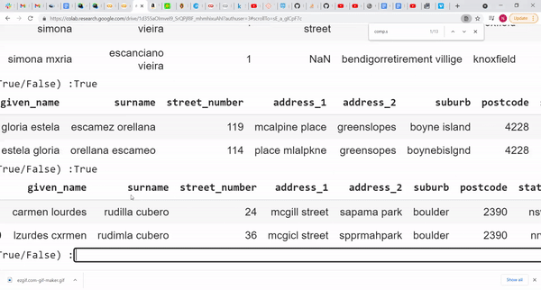

ensemble.py
===========

This repo contains an implementation of a record linkage algorithm roughly based on the paper `A novel ensemble learning approach to unsupervised record linkage <https://www.sciencedirect.com/science/article/abs/pii/S0306437916305063>`__ along with several demonstrations in .ipynb notebooks. The implementation differs from the aforementioned paper in several important ways.

-  The algorithm starts with a small amount of labeled training data as opposed to being completely unsupervised so we forgo the automatic seed (data used to train each base classifier) selection process outlined in the paper
-  In addition to the self learning that was proposed, active learning is also used to hand label the lowest confidence pairs

Dependencies
------------

This repository uses Python 3.8+ and relies on several dependencies. We recommend running in a virtual environment as follows:

```bash
python3 -m venv .venv
source .venv/bin/activate
pip install -r requirements.txt
```

How Does It Work?
-----------------
There are several possible workflows that could be implemented using ensemble.py. This document shows how to use the ActiveLearner class in conjunction with the Ensemble class but any of the various components could easily be adapted for many distinct use cases (e.g. self learning without active learning, building an ensemble without using the ActiveLearner class etc.)

First we load all necessary packages

  .. code:: python

    from ensemble import ActiveLearner, Ensemble
    import recordlinkage
    from sklearn.linear_model import LogisticRegression
    from sklearn.ensemble import RandomForestClassifier as RFC
    import pandas as pd
    import numpy as np

ActiveLearner class
-----------

Next, create dataframes for the two datasets that we are trying to link. Then a blocking scheme should be implemented and distance measurements should be computed for all pairs in each block. The indices of the resulting dataframe should be a pandas MultiIndex object. This could be accomplished in any way the user likes, however the `recordlinkage package <https://recordlinkage.readthedocs.io/en/latest/about.html>`__ is a straightforward way to accomplish this task. There are many examples in the recordlinkage docs and this step is highly customizable but the code would look something like the followings

  .. code:: python

    df_org1 = pd.DataFrame(data_set_1)
    df_org2 = pd.DataFrame(data_set_2)

    indexer = recordlinkage.Index()
    indexer.block(left_on=blocking_variable, right_on=blocking_variable)
    candidate_pairs = indexer.index(df_org1, df_org2)

    comp.string(columns_1, columns_1, method=distnance_measure)
    comp.string(columns_2, columns_2', method=distnance_measure)
    # add other columns here
    . . .
    df_compare = comp.compute(candidate_pairs, df_org1, df_org2)

A subset of these pairwise comparisons should be labeled by hand (match vs non-match) with at least 1 match. The data should then be split into a dataframe containing the labeled data, a corresponding list of labels and a dataframe containing the unlabeled data

  .. code:: python

    X_train = # labeled data
    y_train = # labels
    X_unlabeled = # the remaining unlabeled data

After the data is split we initialize a sklearn classifier we wish to use and we initialize the ActiveLearner class. The class takes the following parameters:

    Parameters
   	df_org1 : dataframe
   		first of two datasets for record linkage
   	df_org2 : dataframe
   		second of two datasets for record linkage
   	X_labeled : dataframe
   		labeled data for training with labels removed
   	y_labeled : series
   		labels for training data
   	X_unlabeled : dataframe
   		unlabeled data
   	model : sklearn classifier
   		classifier that has .fit, .predict and .predict_proba methods
   	n_certain : int
   		how many high confidence pairs to add to training data during each iteration
   	n_uncertain : int
   		how many low confidence pairs to label by hand during each iteration

  The code for this step might look like:

  .. code:: python

    lr = LogisticRegression(penalty='l2')
    AL = ActiveLearner(df_org, df_dup, X_train, y_train, X_test, lr, 1000, 10)

The self/active learning process is conducted as follows:

Train the classifier with the hand labeled data

  .. code:: python

    AL.train()


During training the ActiveLearner class will automatically add the n_certain highest confidence pairs to the training set and remove them from the unlabeled dataframe. Then if the n_uncertain parameter is not set to False the user will be prompted to hand label n_uncertain pairs which will be automatically added to the training data and removed from the unlabeled dataframe.

The process of hand labeling data points is initiated by the clerical_review() method

  .. code:: python

    AL.clerical_review()

The hand labeling process is shown below. Matches are labeled True and non-matches are labeled False. The user will be notified once all uncertain pairs are labeled.



This process is repeated iteratively until the user is satisfied with the size of the training set.

The user can pull out the labelled data from the ActiveLearner class to train whatever classifier they choose. We will demonstrate how to use this data to train the Ensemble method.

Ensemble method
------

The basic idea behind the ensemble approach is the recognition that any classifier that we train is going to be wrong sometimes. Different classifiers are likely better at handling different kinds of data. But how do we know which classifier to use for which data? With an ensemble approach we don't have to know the answer to this question. We combine many different classifiers and let them "vote". Our final prediction is the most common class predicted by the model. When building all of the base classifiers we aim to find a set of base classifiers that is diverse in terms of their ability to handle various nuances of our data. The steps that allow us to do this are outlined below.

The first step is to initialize the class.

    Parameters
   	df_1 : dataframe
   		first of two datasets for record linkage
   	df_2 : dataframe
   		second of two datasets for record linkage
    candidate_pairs : pd.MultiIndex
      pd.MultiIndex of the candidate_pairs that need
      to be compared in df_1 and df_2

  .. code:: python

    Ens = Ensemble(df_org1, df_org2, candidate_pairs)

Next we wish to find a set measurement schemes with the highest amount of diversity on our data. The measurement scheme is the set of distance measures that we use on each column. So for example we might use jarowinkler and levenshtein on the name columns then damerau_levenshtein and qgram on the address column etc. The specific algorithm for this process is outlined in the paper linked above. The method takes in as parameters a number p between 0 and 1 and a boolean True/False.

  .. code:: python

    Ens.measurement_scheme(.5, True)

In the paper it is shown that for all C_i in the set of all possible measurement schemes there exists a C_j in the selected set of measurement schemes such that for all fields (ex. name, address etc) the cosine similarity is greater than p. The parameter p will affect the number of distance measures that will be used on each field which will in turn affect the number of base classifiers that the model will ultimately train. The boolean parameter will determine whether or not the method will return the measurement schemes. Regardless of the value of this parameter the measurement schemes will be saved internally in the Ensemble class.

Next up we apply the measurement schemes to the data.

  .. code:: python

    Ens.build_schemes(False, 100)

This method iterates over all possible combinations of distance measures computed using the measurement_scheme() method. Each scheme is used to compute a separate dataframe of distance measures. For example we might have:

-  scheme 1 (dataframe 1): jarowinkler on name, damerau_levenshtein on address, . . .
-  scheme 2 (dataframe 2): jarowinkler on name, qgram on address, . . .
-  scheme 3 (dataframe 3): levenshtein on name, damerau_levenshtein on address, . . .
-  scheme 4 (dataframe 4): . . .

The parameters are a boolean and an optional integer n. The bool is used to specify whether or not the dataframes are returned. If parameter n is given the method only computes the first n measurement schemes. The parameter can be used during experimentation with the Ensemble class because this method can be very time consuming if run in its entirety. During final prediction time n should not be passed.

Next we train the ensemble. If the user wishes to train the model with the data that was labeled using the ActiveLearner class the code might look like the following:

  .. code:: python

    model_list = [LogisticRegression(penalty='l2') for _ in range(100)]
    indices_train_AL = AL.X_train.index
    y_train_AL = AL.y_train
    Ens.train_ensemble(indices_train_AL, y_train_AL, model_list)

Notice we are passing three parameters into the function, the indices for the labeled data, the labels for the labeled data and a list of base classifiers that will be trained. Note that we are pulling the training data directly from the ActiveLearner class. Also the list of base classifiers can be any combination of classifiers that have a .fit and .predict method as long as the len(model_list) == n (parameter from build_schemes method) or len(model_list) == len(self.compare_dict) if the optional parameter n is not passed (in other words one classifier for each dataframe).

Lastly we can use our trained model to predict unlabeled data. The method takes a pandas MultiIndex object as an argument. These should be the indices of the unlabeled data that we wish to predict. If the user wishes to use the unlabeled data from the ActiveLearner class the code might look like this:

  .. code:: python

    indices_test_AL = AL.X_nolabel.index
    y_pred = Ens.pred_ensemble(indices_test_AL)


License
-------

MIT
